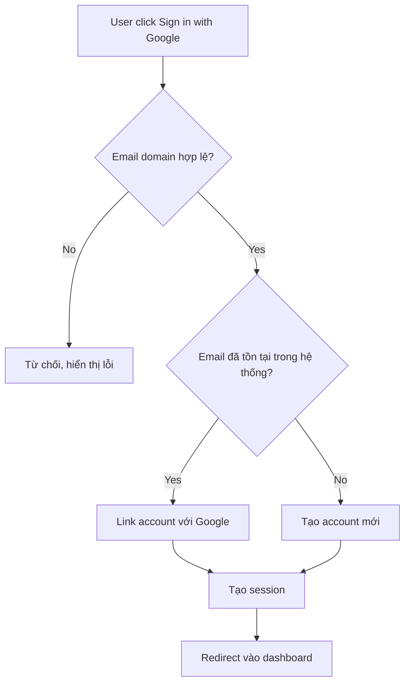

# Flowchart (Mermaid)

Vẽ bằng cú pháp `flowchart` của Mermaid, hướng `TD` (top-down) hoặc `LR` (left-right), đặt trong code block ```mermaid.

## Cú pháp cơ bản



## Ký hiệu node

- `[...]` : process/action (hình chữ nhật)
- `{...}` : decision point (hình thoi) — luôn có ít nhất 2 nhánh ra với nhãn rõ điều kiện (`-- Yes -->`, `-- No -->`)
- `([...])` : start/end (hình stadium)
- `[[...]]` : subroutine/subprocess (gọi tới flow khác)

## Quy tắc

- Mỗi decision node (`{...}`) phải có nhãn rõ trên MỌI nhánh ra — không để nhánh không nhãn.
- Tránh vẽ quá nhiều node trong 1 flowchart (>15 node); nếu flow quá phức tạp, tách thành nhiều flowchart con, dùng `[[...]]` để tham chiếu.
- Khác với sequence diagram: flowchart tập trung vào **logic/quyết định nội bộ**, không quan tâm thứ tự tương tác theo thời gian giữa nhiều actor — nếu cần thể hiện message qua lại giữa nhiều service, dùng skill sequence-diagram thay vì cái này.
- KHÔNG đặt dấu ngoặc kép (`"`) bên trong nhãn node (`[...]`, `{...}`, `([...])`) — Mermaid hiểu `"` như ký tự mở/đóng chuỗi đặc biệt trong ngữ cảnh này, một dấu `"` lẻ dễ làm parse lỗi và diagram không render được gì cả (chỉ hiện text thô). Nếu cần nhấn mạnh cụm từ, bỏ dấu ngoặc kép hoặc dùng dấu nháy đơn (`'...'`).

## Hiển thị cho user xem

Code block ```mermaid``` không tự render thành hình trong môi trường chat này — user chỉ thấy text thô, phải copy đi nơi khác mới xem được. Để user xem được sơ đồ thật ngay tại chỗ, publish bằng tool Artifact:

- Nhúng đúng đoạn `flowchart` đã vẽ vào `<pre class="mermaid">...</pre>` trong một file HTML, publish bằng tool Artifact.
- Bắt buộc load skill `artifact-design` trước khi publish (yêu cầu cứng của tool Artifact) — nhưng vì đây chỉ là một sơ đồ kỹ thuật để xem nhanh/kiểm tra, chọn treatment tối giản, utilitarian: tiêu đề ngắn + khung chứa diagram (đảm bảo `overflow-x: auto` vì flowchart nhiều node dễ tràn ngang), không cần hero, minh họa, hay hệ thống type phức tạp — tránh tốn công thiết kế không cần thiết cho một tác vụ vốn chỉ cần "xem cho đúng".
- Vẫn phải tôn trọng phần cứng bắt buộc của Artifact: theme sáng/tối đều đọc được, `body` có `background` tường minh.
- Khi user chỉ nói "test"/"thử" mà không cần bản đẹp để chia sẻ, ưu tiên tốc độ và tối giản hơn là đầu tư thẩm mỹ.
- KHÔNG tự `list`/dò title để tìm artifact cũ — việc này do bên gọi skill (ví dụ agent `interviewer`) quản lý, không phải trách nhiệm của skill này. Skill chỉ quan tâm 2 việc:
  - Nếu prompt gọi skill có kèm sẵn **1 artifact URL đã có từ trước** (do caller truyền vào để yêu cầu cập nhật) → publish lại đúng file với `url` đó để ghi đè lên artifact đó, không tạo mới.
  - Nếu prompt không kèm URL nào → publish mới bình thường (không truyền `url`). Sau khi publish xong, **luôn nói rõ URL vừa tạo trong câu trả lời** để caller (agent gọi skill) có thể tự lưu lại và tái sử dụng cho lần sau nếu cần — không được im lặng bỏ qua bước báo URL này.
- Đặt title mô tả đúng nội dung diagram lần này (không bắt buộc cố định "Flowchart Preview" nữa vì việc chọn artifact nào để update giờ do caller quyết định qua URL, không còn dựa vào title).
