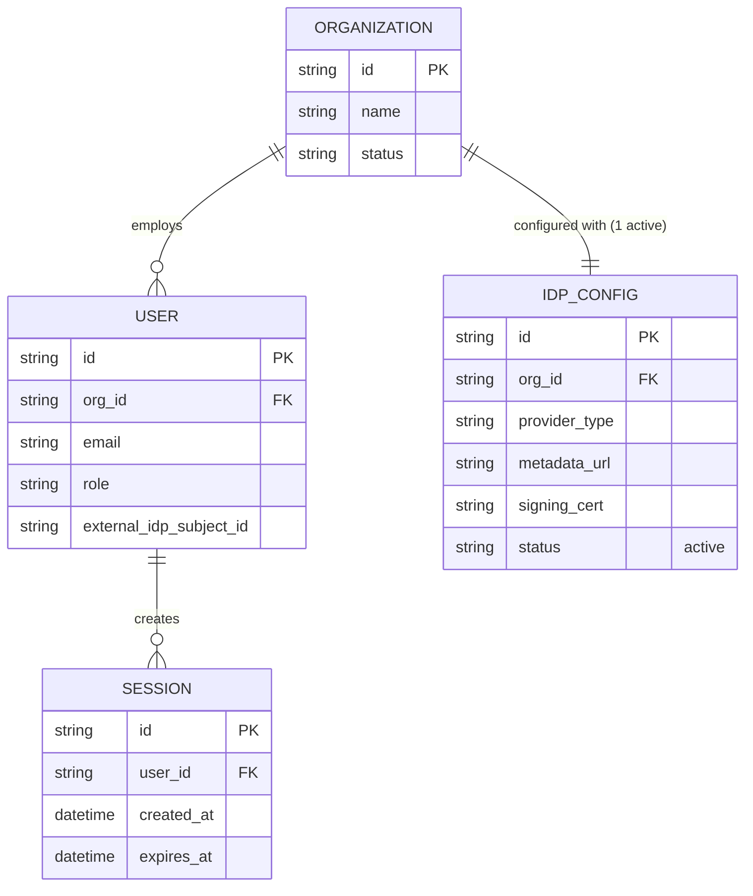

# Base ERD — SSO-only B2B SaaS trước khi có cơ chế khôi phục

Đây là **base**: mô hình dữ liệu suy luận từ ngữ cảnh đề bài, thể hiện trạng thái hệ thống **trước khi** có yêu cầu khôi phục quyền truy cập cấp tổ chức. Đề bài nói tài khoản "SSO-only, không có mật khẩu riêng" và mỗi công ty khách hàng dùng 1 IdP để đăng nhập — nên base chỉ cần đủ 4 entity nền tảng để việc "IdP hỏng → cả tổ chức bị khóa" có ý nghĩa: tổ chức, cấu hình IdP (đúng 1 cấu hình đang active mỗi tổ chức), user thuộc tổ chức, và session đăng nhập. Chưa có bất kỳ entity nào phục vụ khôi phục/break-glass/cutover — những thứ đó là phần enhance.

