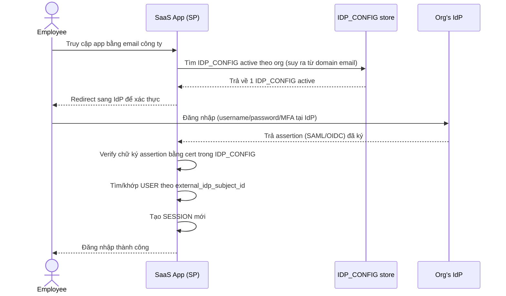

# Base sequence — SSO Login

Đây là **base**, flow "Đăng nhập qua SSO" — tiền đề trực tiếp cho enhance: chính vì mọi nhân viên chỉ đăng nhập được qua **đúng 1** IdP đang active của tổ chức, nên khi IdP đó hỏng, toàn bộ tổ chức bị khóa cùng lúc (vấn đề gốc mà đề bài yêu cầu giải quyết).

