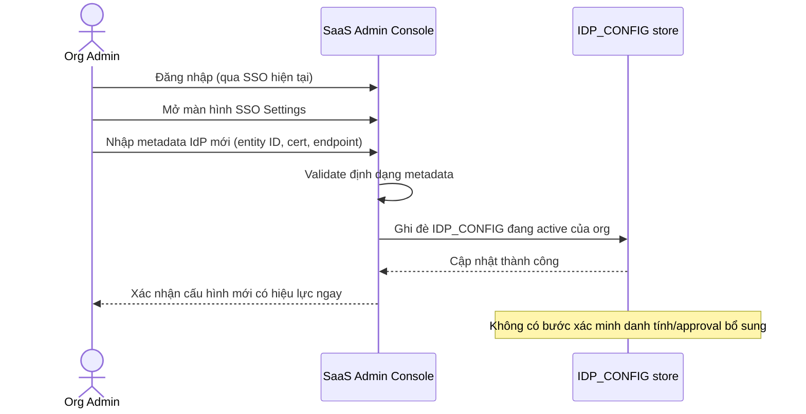

# Base sequence — Configure IdP

Đây là **base**, flow "Admin cấu hình lại IdP cho tổ chức" ở trạng thái hiện tại — chưa có xác minh chặt chẽ. Flow này liên quan mật thiết tới enhance vì yêu cầu thứ 2 của đề bài ("việc xác minh ai có quyền yêu cầu chuyển đổi/cấu hình lại SSO phải chặt chẽ") chính là siết lại flow này để tránh kẻ tấn công giả danh admin trỏ SSO sang IdP do chúng kiểm soát.

