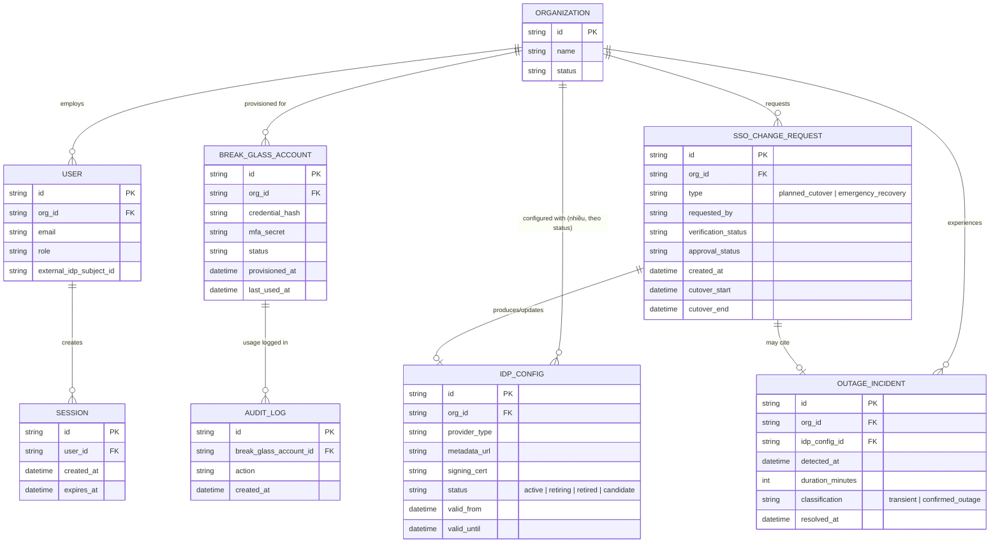

# Enhance ERD — sau khi có cơ chế khôi phục cấp tổ chức

Đây là ERD **sau khi** enhance được áp dụng lên base. So với base, có 4 thay đổi chính, ứng trực tiếp với 5 yêu cầu trong đề bài:

- `IDP_CONFIG` chuyển từ 1-1 (1 active/org) sang 1-N, thêm `status` (active/retiring/retired/candidate) và khoảng hiệu lực — để hỗ trợ chạy song song 2 IdP trong lúc cutover có kế hoạch.
- `BREAK_GLASS_ACCOUNT` (mới) — tài khoản cấp tổ chức được thiết lập sẵn từ trước, không tạo lúc khẩn cấp, có MFA riêng và theo dõi lần dùng gần nhất.
- `SSO_CHANGE_REQUEST` (mới) — mọi yêu cầu đổi/cấu hình lại IdP (dù chủ động hay khẩn cấp) đều phải đi qua 1 request có xác minh + trạng thái duyệt, thay vì ghi đè trực tiếp như base.
- `OUTAGE_INCIDENT` (mới) — ghi nhận và phân loại sự cố IdP (tạm thời hay thực sự cần chuyển) trước khi cho phép mở `SSO_CHANGE_REQUEST` loại khẩn cấp.
- `AUDIT_LOG` (mới) — giám sát chặt việc sử dụng break-glass account.

