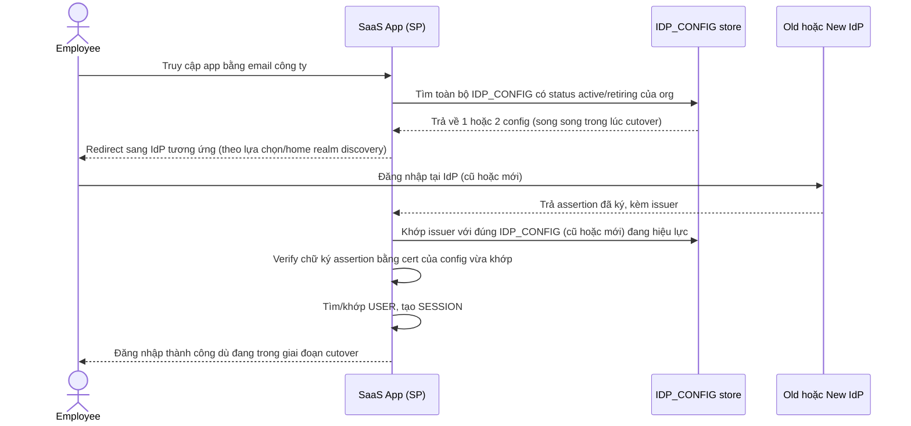

# Enhance sequence — SSO Login

Đây là **enhance**, cùng flow "SSO Login" đã có ở base nhưng nay thay đổi để hỗ trợ yêu cầu "chạy song song IdP cũ và mới trong thời gian chuyển tiếp": app không còn giả định org chỉ có đúng 1 `IDP_CONFIG` active, mà phải khớp assertion trả về với đúng cấu hình (cũ hoặc mới) đang hiệu lực tại thời điểm đó — nhờ vậy không có khoảnh khắc nào cả tổ chức bị khóa giữa chừng khi cutover có kế hoạch.

