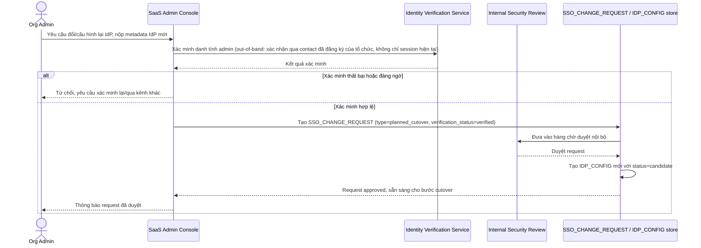

# Enhance sequence — Configure IdP

Đây là **enhance**, cùng flow "Admin cấu hình lại IdP" đã có ở base nhưng nay thay đổi hoàn toàn theo yêu cầu thứ 2 của đề bài: không còn ghi đè trực tiếp `IDP_CONFIG`, mà phải qua `SSO_CHANGE_REQUEST` với xác minh danh tính chặt chẽ + duyệt nội bộ, để tránh kẻ tấn công giả danh admin trỏ SSO sang IdP do chúng kiểm soát.

