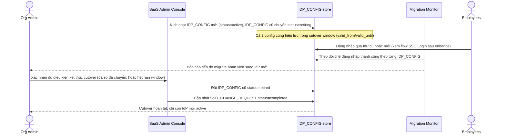

# Enhance sequence — Planned IdP cutover

Đây là **enhance**, flow hoàn toàn mới, phát sinh từ enhance — chưa tồn tại ở base. Đáp ứng yêu cầu thứ 4 của đề bài: khi tổ chức chủ động đổi IdP theo kế hoạch, cho phép chạy song song IdP cũ và mới trong 1 khoảng thời gian chuyển tiếp, để không có khoảnh khắc nào cả tổ chức bị khóa. Flow này tiếp nối ngay sau khi `SSO_CHANGE_REQUEST` được duyệt ở flow "Configure IdP".

