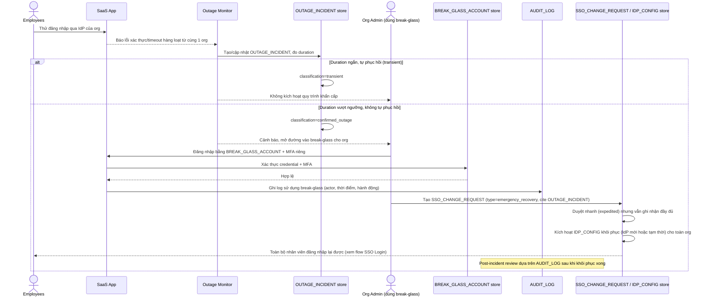

# Enhance sequence — Emergency org-wide recovery (break-glass)

Đây là **enhance**, flow hoàn toàn mới, phát sinh từ enhance — chưa tồn tại ở base. Đây là flow trung tâm của đề bài, gộp 3 yêu cầu còn lại: (1) khôi phục cấp tổ chức thay vì xử lý từng user khi IdP hỏng hoàn toàn, (2) dùng `BREAK_GLASS_ACCOUNT` đã thiết lập sẵn từ trước kèm giám sát chặt (`AUDIT_LOG`), và (3) phải phân biệt sự cố tạm thời với việc thực sự cần khôi phục khẩn cấp trước khi kích hoạt quy trình rủi ro cao này.

