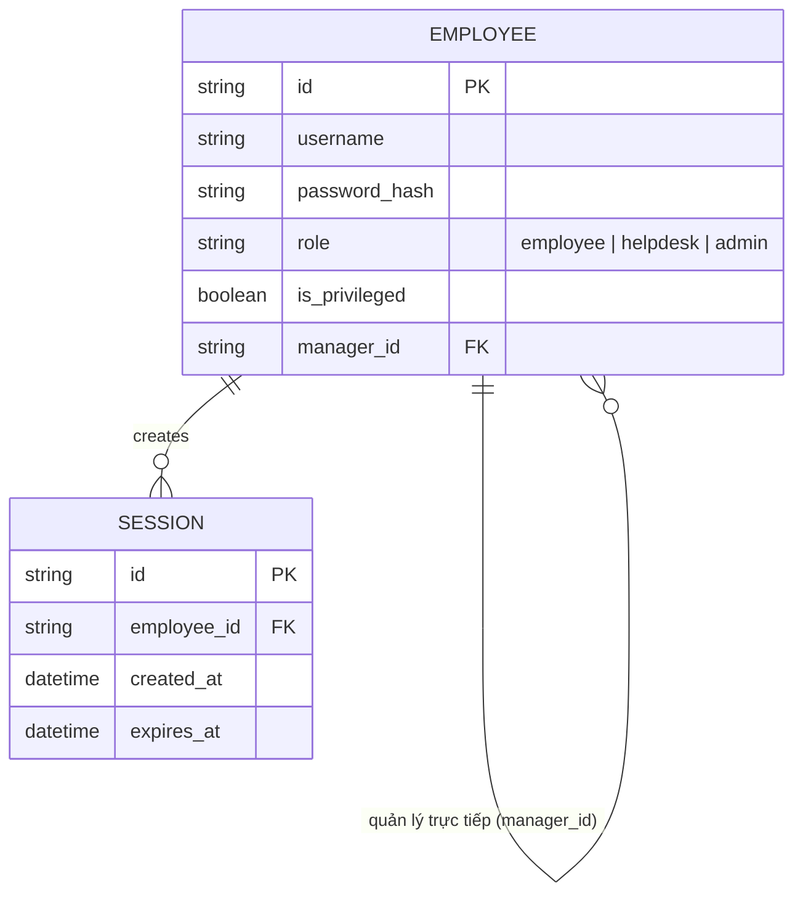

# Base ERD — hệ thống tài liệu nội bộ trước khi có quy trình break-glass

Đây là **base**: mô hình dữ liệu suy luận từ ngữ cảnh đề bài, thể hiện trạng thái hệ thống **trước khi** có quy trình khôi phục tài khoản do helpdesk xử lý. Đề bài nói hệ thống đăng nhập bằng mật khẩu, có phân biệt tài khoản thường/tài khoản quyền cao, và việc xác minh danh tính "qua quản lý trực tiếp" — nên base chỉ cần đủ: nhân viên (kèm mật khẩu, cờ quyền cao, và quan hệ quản lý trực tiếp) và session đăng nhập. Chưa có bất kỳ entity nào ghi nhận ticket reset/MFA của helpdesk/audit log/phát hiện bất thường — những thứ đó là phần enhance.

