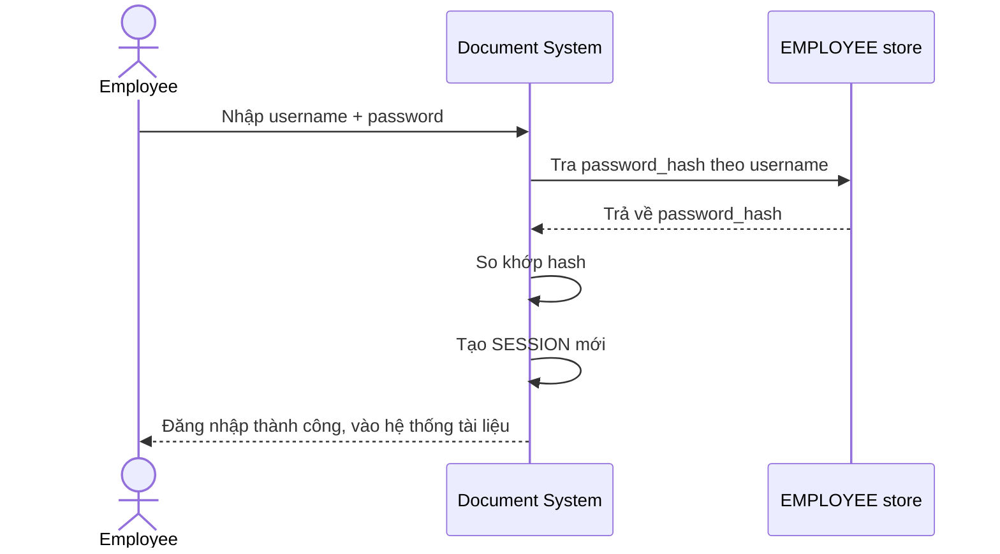

# Base sequence — Login

Đây là **base**, flow "Đăng nhập bằng username/password" — tiền đề trực tiếp cho enhance: chính vì hệ thống xác thực bằng mật khẩu tĩnh và cấm self-service reset, nên khi nhân viên quên mật khẩu, họ hoàn toàn phụ thuộc vào helpdesk (vấn đề mà đề bài yêu cầu xây quy trình xử lý).

