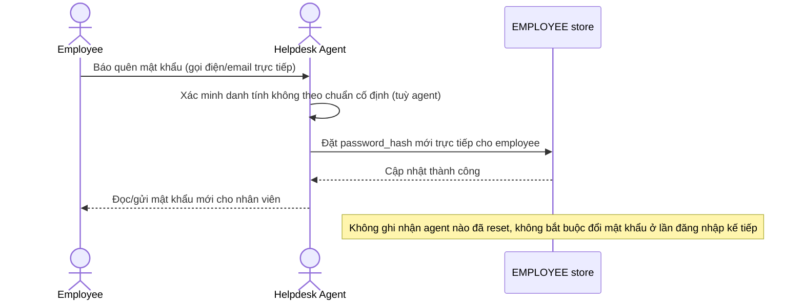

# Base sequence — Password reset (ad-hoc, chưa có quy trình chuẩn)

Đây là **base**, flow "Helpdesk reset mật khẩu cho nhân viên" ở trạng thái hiện tại — không có ticket, không có xác minh danh tính chuẩn hoá, không MFA, không log. Flow này liên quan mật thiết tới enhance vì toàn bộ 5 yêu cầu của đề bài đều nhằm siết lại đúng flow này.

