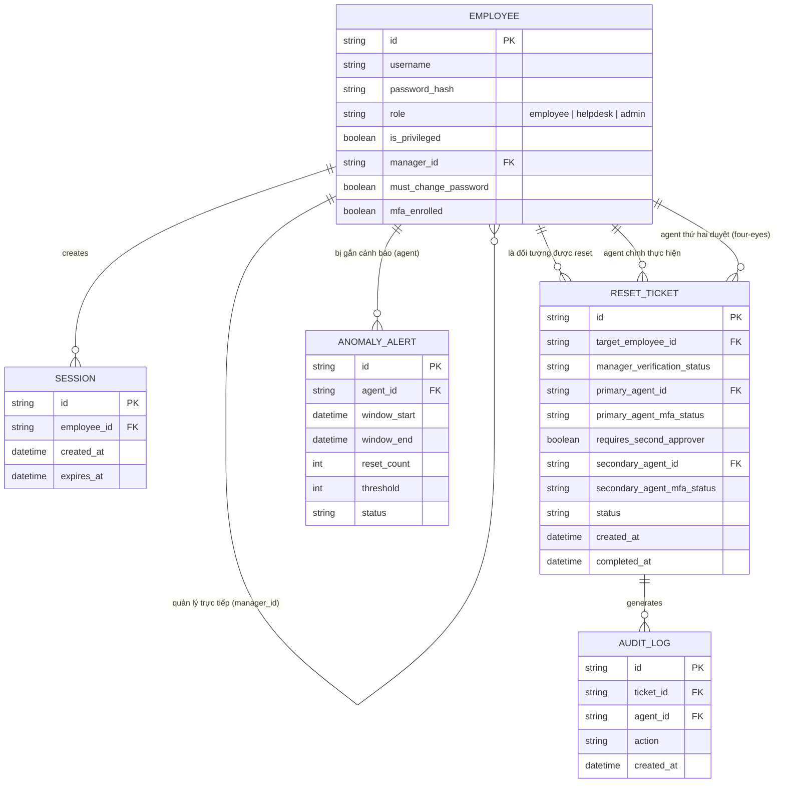

# Enhance ERD — sau khi có quy trình break-glass do helpdesk xử lý

Đây là ERD **sau khi** enhance được áp dụng lên base. So với base, có 4 thay đổi chính, ứng trực tiếp với 5 yêu cầu trong đề bài:

- `EMPLOYEE` thêm `must_change_password` và `mfa_enrolled` — buộc đổi mật khẩu tạm ở lần đăng nhập kế tiếp, và bắt buộc MFA cho agent trước khi thực hiện reset.
- `RESET_TICKET` (mới) — mọi yêu cầu reset đều phải đi qua ticket gắn xác minh danh tính (qua quản lý trực tiếp), thay vì xử lý miệng như base; có `requires_second_approver`/`secondary_agent_id` để áp dụng four-eyes cho tài khoản quyền cao.
- `AUDIT_LOG` (mới) — ghi nhận agent nào đã reset cho tài khoản nào.
- `ANOMALY_ALERT` (mới) — phát hiện agent reset số lượng tài khoản bất thường trong thời gian ngắn.

