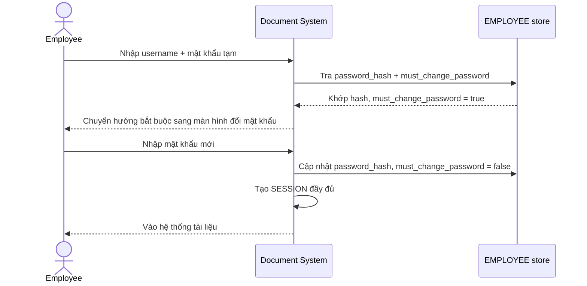

# Enhance sequence — Login

Đây là **enhance**, cùng flow "Login" đã có ở base nhưng nay thay đổi theo yêu cầu thứ 2 của đề bài: sau khi xác thực bằng mật khẩu tạm do helpdesk cấp, hệ thống kiểm tra `must_change_password` và **buộc đổi mật khẩu ngay** trước khi cấp session đầy đủ — không cho phép dùng mật khẩu tạm lâu dài như base.

