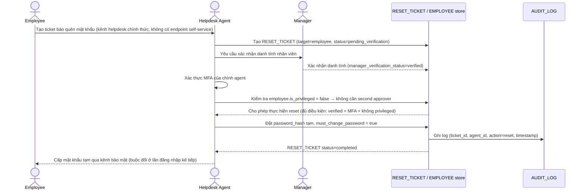

# Enhance sequence — Password reset (tài khoản thường)

Đây là **enhance**, cùng flow "Password reset" đã có ở base nhưng nay thay đổi hoàn toàn theo yêu cầu 1-3 của đề bài: không còn xử lý miệng, mà bắt buộc qua `RESET_TICKET` gắn xác minh qua quản lý trực tiếp, agent phải xác thực MFA trước khi thực hiện, và mọi thao tác được ghi vào `AUDIT_LOG`. Áp dụng cho tài khoản **không** phải quyền cao (`is_privileged = false`) — tài khoản quyền cao xem flow "Privileged account reset" riêng.

