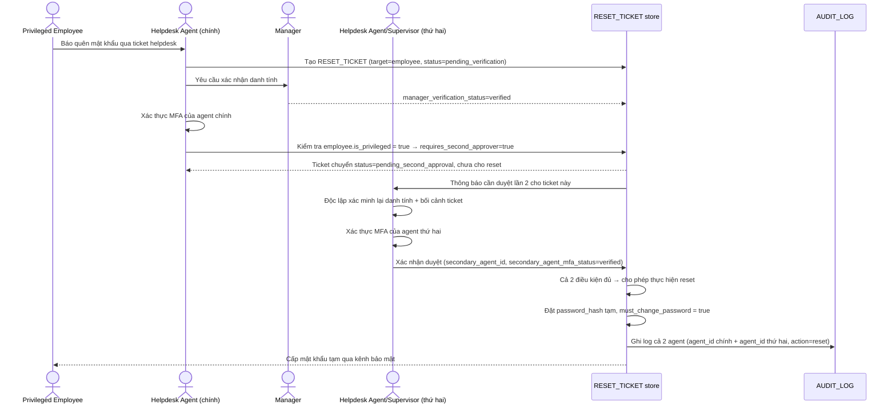

# Enhance sequence — Privileged account reset (four-eyes)

Đây là **enhance**, flow hoàn toàn mới, phát sinh từ enhance — chưa tồn tại ở base. Đáp ứng yêu cầu thứ 4 của đề bài: tài khoản quyền cao (`is_privileged = true`, vd admin hệ thống tài liệu) phải có **2 agent** xác nhận độc lập trước khi reset, không cho 1 agent đơn lẻ tự thực hiện.

