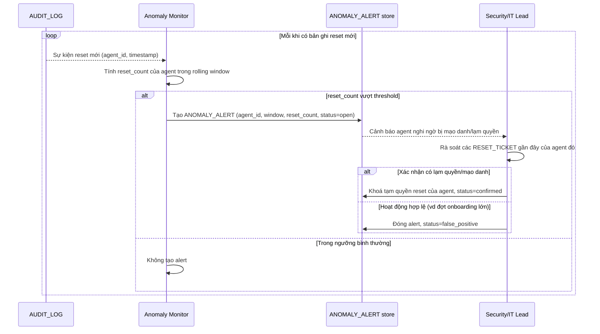

# Enhance sequence — Reset anomaly detection

Đây là **enhance**, flow hoàn toàn mới, phát sinh từ enhance — chưa tồn tại ở base. Đáp ứng yêu cầu thứ 5 của đề bài: phát hiện khi 1 helpdesk agent thực hiện reset cho số lượng tài khoản lớn bất thường trong thời gian ngắn — dấu hiệu agent bị mạo danh hoặc lạm quyền.

