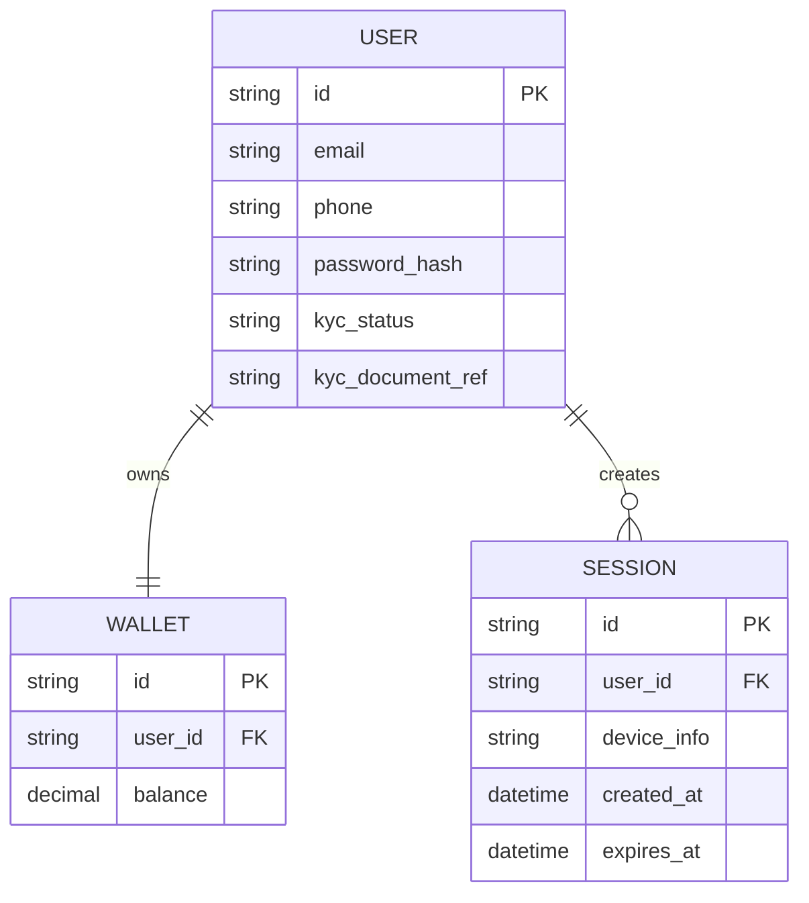

# Base ERD — Fintech app trước khi có quy trình khôi phục khi mất cả 2 kênh

Đây là **base**: mô hình dữ liệu suy luận từ ngữ cảnh đề bài, thể hiện trạng thái hệ thống **trước khi** có quy trình khôi phục cho case "mất cả email lẫn số điện thoại". Đề bài nói tài khoản gắn với tiền thật và đăng ký bằng email/số điện thoại — nên base chỉ cần đủ: user (kèm 2 kênh liên hệ + trạng thái KYC), wallet (số dư, để sau này đối chiếu việc đóng băng rút/chuyển tiền), và session đăng nhập. Chưa có bất kỳ entity nào phục vụ xác minh danh tính thủ công/audit trail/đóng băng tài khoản — những thứ đó là phần enhance.

