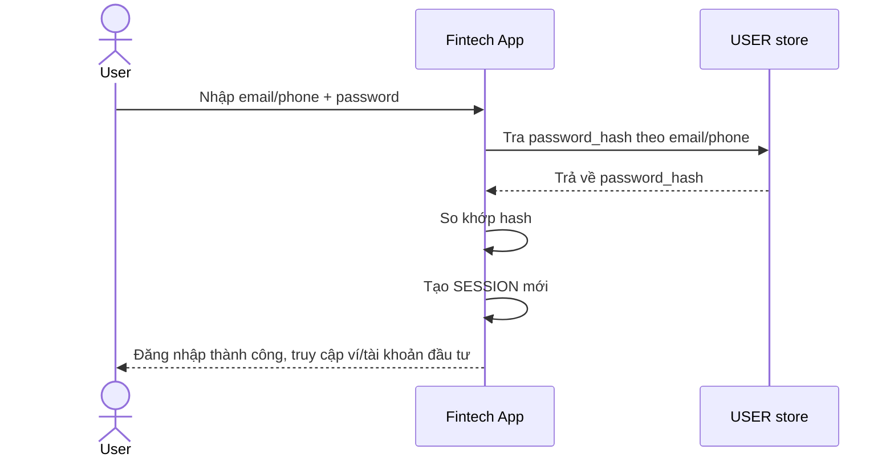

# Base sequence — Login

Đây là **base**, flow "Đăng nhập bằng email/phone + password" — tiền đề trực tiếp cho enhance: chính vì tài khoản gắn với 2 kênh liên hệ cố định (email, phone) để xác thực/khôi phục, nên khi mất cả 2 kênh này, các cơ chế thông thường (login lẫn recovery chuẩn) đều vô hiệu — đó là case khó mà đề bài yêu cầu xử lý.

