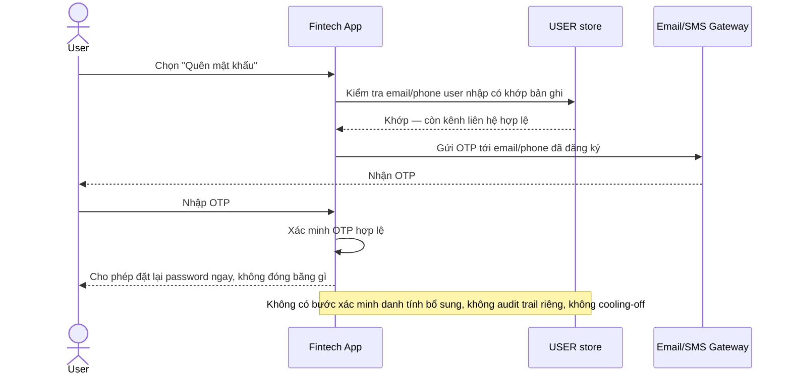

# Base sequence — Channel-based recovery (còn giữ được 1 kênh)

Đây là **base**, flow "Khôi phục qua OTP email/SMS" — quy trình khôi phục thông thường khi user **còn quyền truy cập ít nhất 1 kênh** đã đăng ký. Flow này liên quan mật thiết tới enhance vì nó chính là "đường dễ" sẽ **không áp dụng được** khi mất cả 2 kênh, buộc hệ thống phải chuyển sang quy trình xác minh danh tính thủ công/bán tự động mà đề bài yêu cầu.

