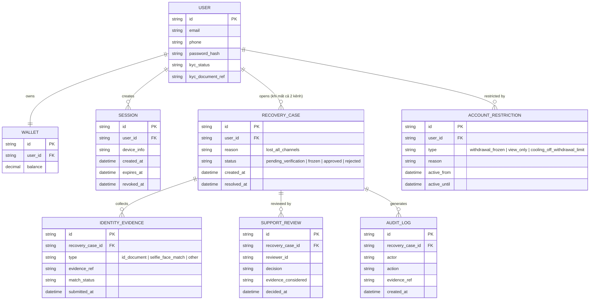

# Enhance ERD — sau khi có quy trình khôi phục khi mất cả 2 kênh

Đây là ERD **sau khi** enhance được áp dụng lên base. So với base, có 4 nhóm entity mới, ứng trực tiếp với 5 yêu cầu trong đề bài:

- `RECOVERY_CASE` (mới) — hồ sơ khôi phục khi không còn kênh nào khớp, theo dõi trạng thái xuyên suốt quy trình.
- `IDENTITY_EVIDENCE` (mới) — nhiều bằng chứng độc lập (giấy tờ tùy thân, face match...) thay vì 1 câu hỏi bảo mật duy nhất, chống social engineering.
- `SUPPORT_REVIEW` (mới) — quyết định của support agent dựa trên bằng chứng, phục vụ four-eyes/kiểm soát con người.
- `AUDIT_LOG` (mới, append-only/immutable) — ghi lại toàn bộ ai duyệt, dựa trên bằng chứng gì, khi nào — phục vụ compliance khi thanh tra.
- `ACCOUNT_RESTRICTION` (mới) — áp dụng cả lúc chờ xác minh (đóng băng rút/chuyển tiền, vẫn xem được) lẫn cooling-off period sau khi khôi phục thành công (giới hạn rút tiền lớn 24-48h).
- `SESSION` thêm `revoked_at` — phục vụ yêu cầu đăng xuất toàn bộ thiết bị/session cũ sau khôi phục.

