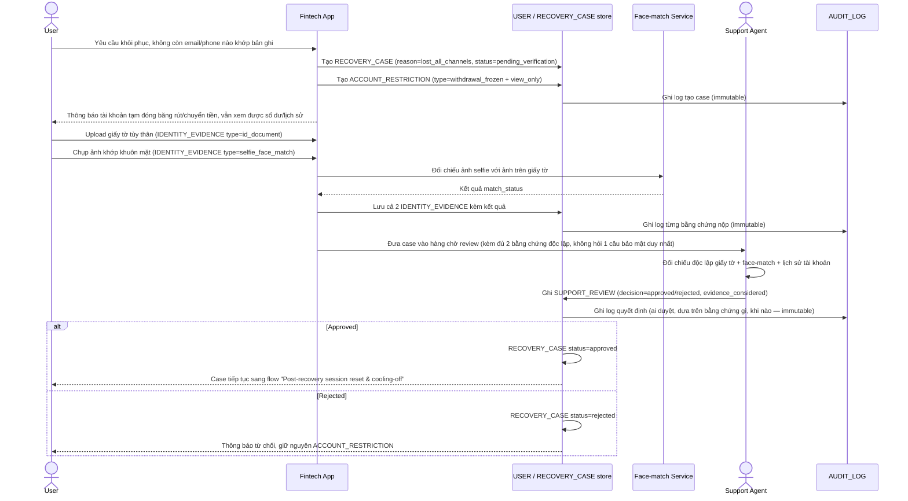

# Enhance sequence — Lost-channels recovery (xác minh danh tính bán tự động)

Đây là **enhance**, flow hoàn toàn mới, phát sinh từ enhance — chưa tồn tại ở base (khác với flow "Channel-based recovery" ở base, vốn chỉ hoạt động khi còn giữ 1 kênh). Đáp ứng yêu cầu 1, 2 và 5 của đề bài: chuyển sang xác minh danh tính thủ công/bán tự động, đóng băng rút/chuyển tiền nhưng vẫn cho xem thông tin, và yêu cầu **nhiều bằng chứng độc lập** để chống social engineering nhắm vào bộ phận hỗ trợ.

