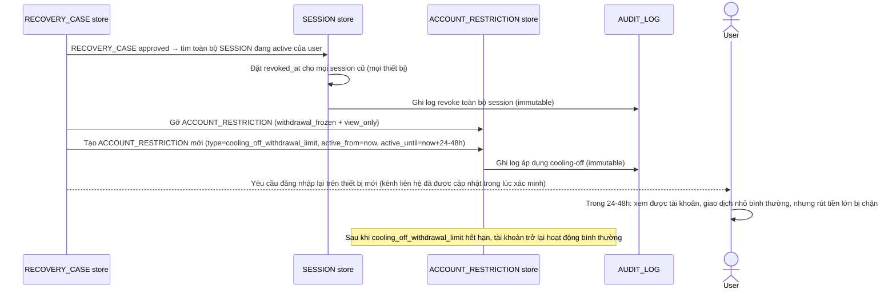

# Enhance sequence — Post-recovery session reset & cooling-off

Đây là **enhance**, flow hoàn toàn mới, phát sinh từ enhance — chưa tồn tại ở base. Đáp ứng yêu cầu thứ 4 của đề bài: sau khi `RECOVERY_CASE` được duyệt (nối tiếp flow "Lost-channels recovery"), toàn bộ session/thiết bị cũ phải bị đăng xuất, và có cooling-off period trước khi cho rút tiền lớn lần đầu.

