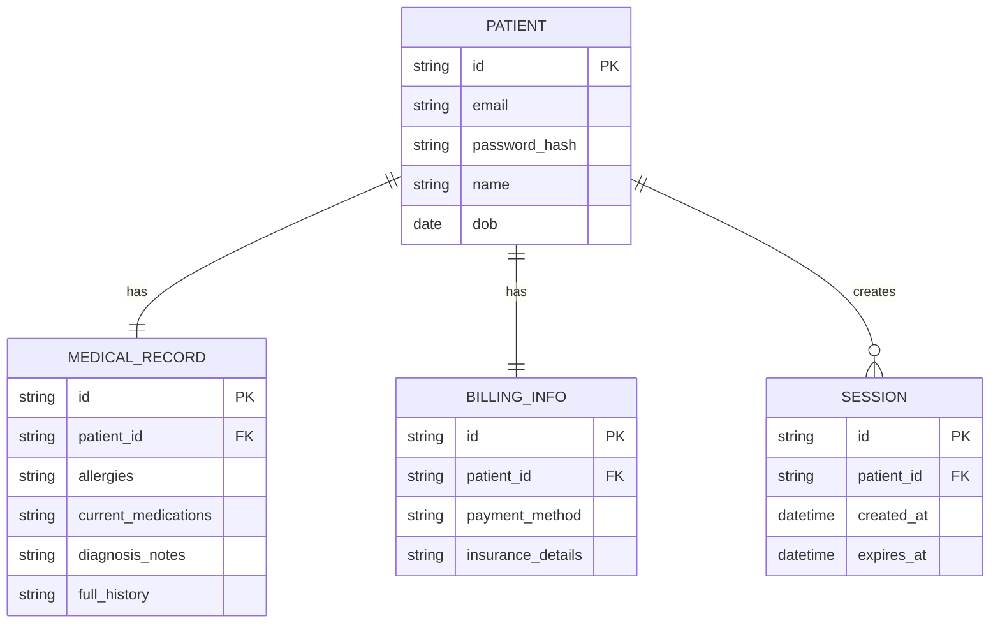

# Base ERD — nền tảng y tế trước khi có phân tầng khôi phục khẩn cấp/giám hộ

Đây là **base**: mô hình dữ liệu suy luận từ ngữ cảnh đề bài, thể hiện trạng thái hệ thống **trước khi** có quy trình khôi phục khẩn cấp và ủy quyền giám hộ. Đề bài nói bệnh nhân xem hồ sơ bệnh án/kết quả xét nghiệm/đặt lịch, và luồng khẩn cấp sau này chỉ được xem "dị ứng và thuốc đang dùng" chứ không được xem "thông tin tài chính" — nên base cần đủ: bệnh nhân, hồ sơ bệnh án (chứa cả phần nhạy cảm như dị ứng/thuốc lẫn phần đầy đủ), thông tin tài chính riêng biệt (để sau này đối chiếu phạm vi bị giới hạn), và session đăng nhập. Chưa có entity nào phục vụ xác minh danh tính nâng cao/quyền khẩn cấp/ủy quyền giám hộ — những thứ đó là phần enhance.

