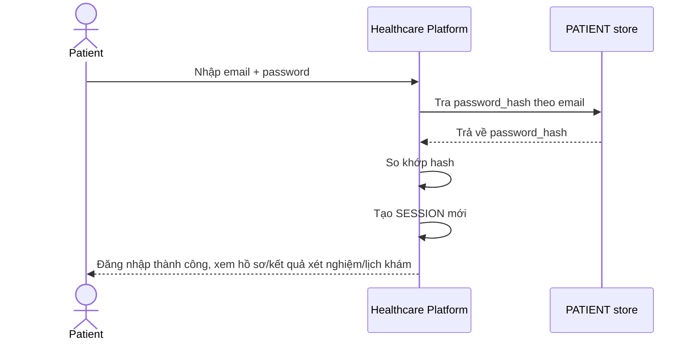

# Base sequence — Login

Đây là **base**, flow "Đăng nhập bằng email/password" — tiền đề cho enhance: chính vì bệnh nhân là người duy nhất tự đăng nhập theo mô hình này, nên các case đặc biệt (bệnh nhân bất tỉnh, trẻ em, người cao tuổi không tự thao tác được, hoặc nhân viên y tế cần xem gấp) đều chưa có đường vào hợp lệ — đó là khoảng trống mà đề bài yêu cầu lấp.

