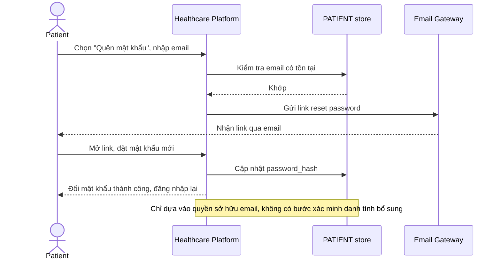

# Base sequence — Password reset (mức xác minh phổ biến)

Đây là **base**, flow "Quên mật khẩu" ở mức xác minh phổ biến — chỉ dựa vào việc sở hữu email, giống chuẩn thường thấy ở đa số hệ thống. Flow này liên quan mật thiết tới enhance vì yêu cầu thứ 4 của đề bài chính là nâng cấp mức xác minh của flow này lên cao hơn do dữ liệu sức khỏe nhạy cảm hơn.

