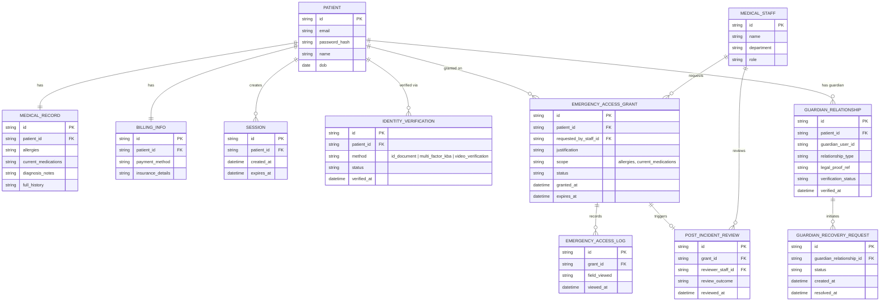

# Enhance ERD — sau khi có phân tầng khẩn cấp/nâng xác minh/ủy quyền giám hộ

Đây là ERD **sau khi** enhance được áp dụng lên base. So với base, có 3 nhóm entity mới, ứng trực tiếp với 5 yêu cầu trong đề bài:

- `IDENTITY_VERIFICATION` (mới) — mức xác minh nâng cao (không chỉ dựa email) cho khôi phục thông thường.
- `EMERGENCY_ACCESS_GRANT` + `EMERGENCY_ACCESS_LOG` + `POST_INCIDENT_REVIEW` (mới) — luồng khẩn cấp riêng cho nhân viên y tế: phạm vi giới hạn (`scope`), tự hết hạn (`expires_at`), log chi tiết từng field đã xem, và review sau sự việc tự động kích hoạt.
- `GUARDIAN_RELATIONSHIP` + `GUARDIAN_RECOVERY_REQUEST` (mới) — quy trình ủy quyền cho người thân/giám hộ hợp pháp, tách biệt hẳn khỏi flow tự khôi phục của chính bệnh nhân.
- `MEDICAL_STAFF` (mới) — actor yêu cầu quyền khẩn cấp và thực hiện review.

