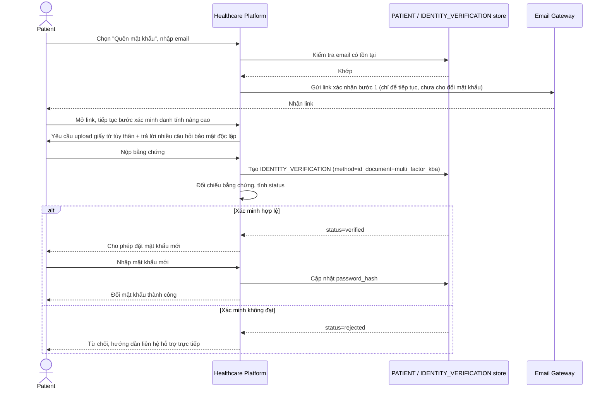

# Enhance sequence — Password reset (mức xác minh nâng cao)

Đây là **enhance**, cùng flow "Password reset" đã có ở base nhưng nay thay đổi theo yêu cầu thứ 4 của đề bài: không còn chỉ dựa vào quyền sở hữu email, mà thêm bước `IDENTITY_VERIFICATION` (vd giấy tờ tùy thân + trả lời nhiều câu hỏi bảo mật độc lập) trước khi cho đổi mật khẩu — chấp nhận chậm hơn để giảm rủi ro lộ hồ sơ bệnh án.

