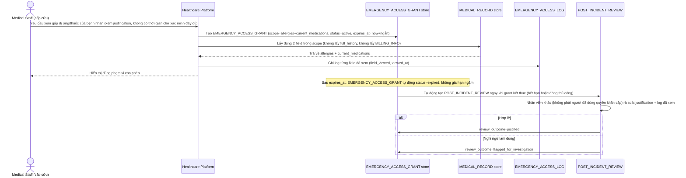

# Enhance sequence — Emergency access (nhân viên y tế cấp cứu)

Đây là **enhance**, flow hoàn toàn mới, phát sinh từ enhance — chưa tồn tại ở base. Đáp ứng yêu cầu 1, 2 và 3 của đề bài: luồng khẩn cấp riêng, không chờ xác minh danh tính đầy đủ của bệnh nhân, nhưng phạm vi bị giới hạn chặt (chỉ dị ứng + thuốc đang dùng), tự hết hạn sau thời gian ngắn, log chi tiết và tự động kích hoạt review sau sự việc.

