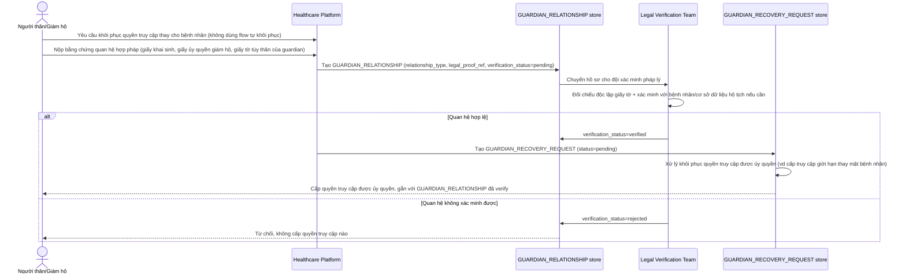

# Enhance sequence — Guardian recovery (người thân/giám hộ hợp pháp)

Đây là **enhance**, flow hoàn toàn mới, phát sinh từ enhance — chưa tồn tại ở base. Đáp ứng yêu cầu thứ 5 của đề bài: xử lý trường hợp bệnh nhân không tự thao tác được (bất tỉnh, trẻ em, người cao tuổi) — quy trình này xác minh mối quan hệ hợp pháp một cách có kiểm soát và **tách biệt hẳn** khỏi flow "Password reset" tự khôi phục của chính chủ tài khoản.

