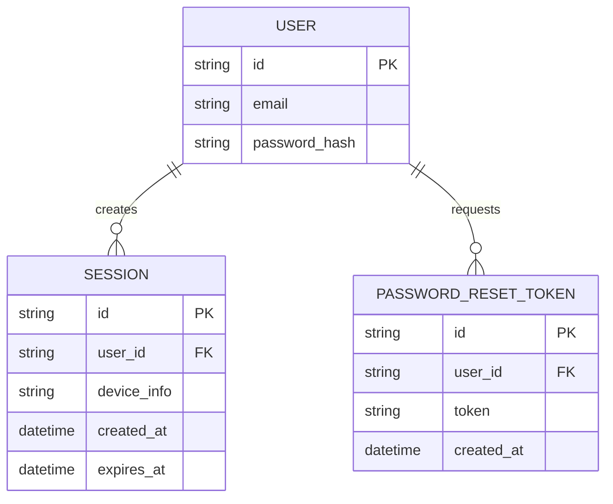

# Base ERD — Marketplace trước khi hardening flow quên mật khẩu

Đây là **base**: mô hình dữ liệu suy luận từ ngữ cảnh đề bài, thể hiện trạng thái hệ thống **trước khi** áp các yêu cầu bảo mật cho flow quên mật khẩu. Đề bài mô tả 1 flow "quên mật khẩu tiêu chuẩn" đã tồn tại (nhập email, nhận link, đặt mật khẩu mới) nhưng chưa an toàn — nên base cần đủ: user (email/password), session đăng nhập, và 1 token reset dạng thô sơ (chưa có hạn dùng/one-time/trạng thái). Chưa có entity nào phục vụ chống enumeration/rate-limit/thu hồi session — những thứ đó là phần enhance.

