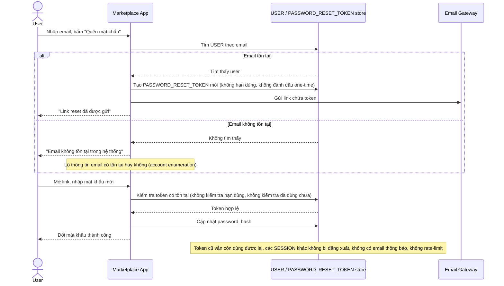

# Base sequence — Forgot password (chưa hardening)

Đây là **base**, flow "Quên mật khẩu" ở trạng thái thô sơ hiện tại — chính flow này là đối tượng mà toàn bộ 5 yêu cầu của đề bài nhắm vào để siết lại.

