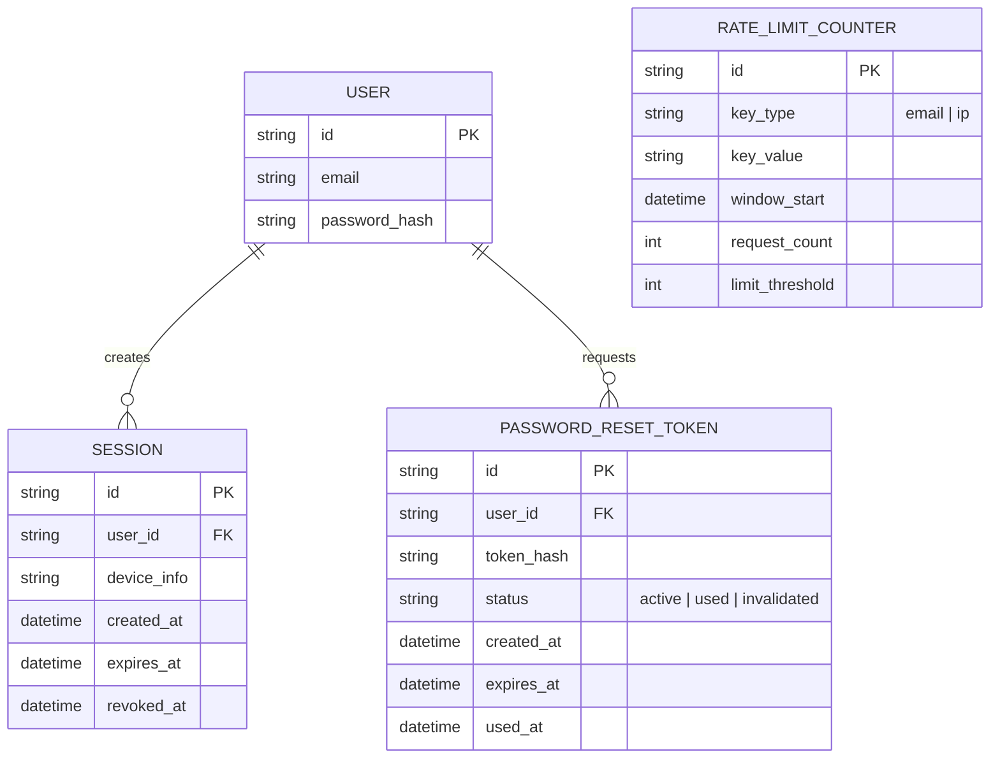

# Enhance ERD — sau khi hardening flow quên mật khẩu

Đây là ERD **sau khi** enhance được áp dụng lên base. So với base, có 2 thay đổi chính, ứng trực tiếp với 5 yêu cầu trong đề bài:

- `PASSWORD_RESET_TOKEN` thêm `status` (active/used/invalidated), `expires_at`, `used_at` — phục vụ yêu cầu token one-time, hết hạn ngắn, và vô hiệu token cũ khi có token mới hoặc khi đổi mật khẩu thành công.
- `SESSION` thêm `revoked_at` — phục vụ yêu cầu đăng xuất toàn bộ session khác sau khi đổi mật khẩu thành công.
- `RATE_LIMIT_COUNTER` (mới) — đếm request theo cả email lẫn IP để chống spam/brute-force dò token.

