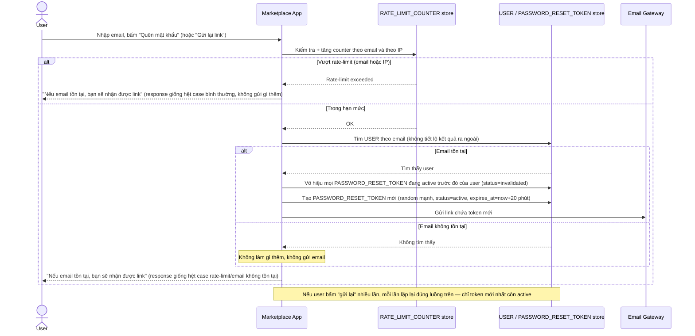

# Enhance sequence — Forgot password (request phase, đã hardening)

Đây là **enhance**, cùng flow "Forgot password" đã có ở base nhưng nay thay đổi theo yêu cầu 1, 3 và 5 của đề bài: response giống hệt nhau dù email tồn tại hay không (chống enumeration), rate-limit theo cả email lẫn IP, và bấm "gửi lại" nhiều lần chỉ token mới nhất còn hiệu lực. So với base: không còn tiết lộ email tồn tại hay không, và request bị chặn khi vượt rate-limit thay vì cho gửi email vô hạn.

