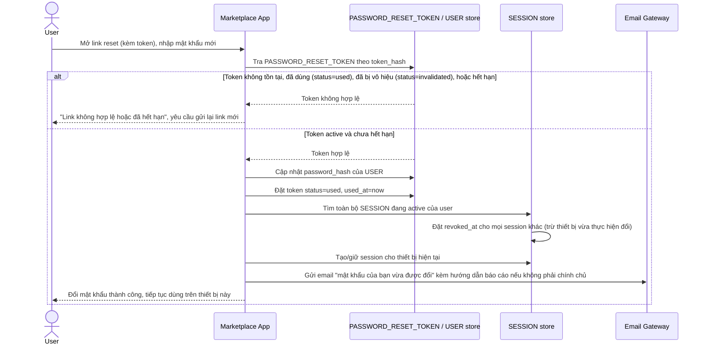

# Enhance sequence — Complete password reset

Đây là **enhance**, flow hoàn toàn mới, phát sinh từ enhance — chưa tách riêng ở base (ở base, bước "đặt mật khẩu mới" chỉ là phần cuối gộp trong 1 flow duy nhất, không có các kiểm soát này). Nối tiếp flow "Forgot password" sau khi user bấm vào link, đáp ứng yêu cầu 2 và 4 của đề bài: token chỉ dùng 1 lần + hết hạn ngắn, và sau khi đổi mật khẩu thành công thì đăng xuất mọi session khác + gửi email thông báo.

