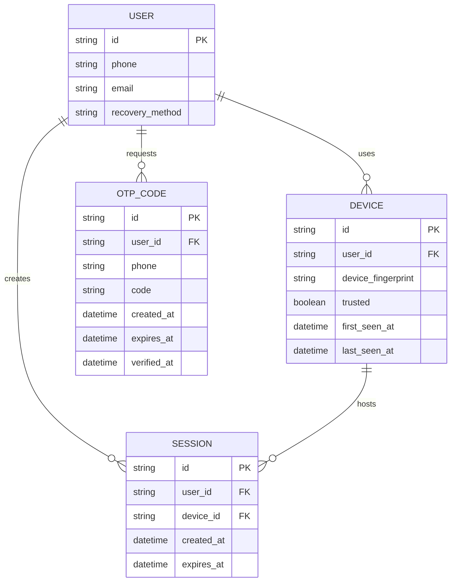

# Base ERD — App di động trước khi có phòng vệ SIM-swap

Đây là **base**: mô hình dữ liệu suy luận từ ngữ cảnh đề bài, thể hiện trạng thái hệ thống **trước khi** có các cơ chế phòng vệ SIM-swap. Đề bài nói số điện thoại là định danh chính + kênh nhận OTP cho cả đăng nhập lẫn khôi phục, và có nhắc tới "thiết bị đã được tin cậy từ trước" — nên base cần đủ: user (gắn phone + email liên kết + phương thức khôi phục), thiết bị (có cờ trusted), session, và OTP code. Chưa có entity nào phục vụ phát hiện SIM-swap/second-factor độc lập/khôi phục ưu tiên — những thứ đó là phần enhance.

