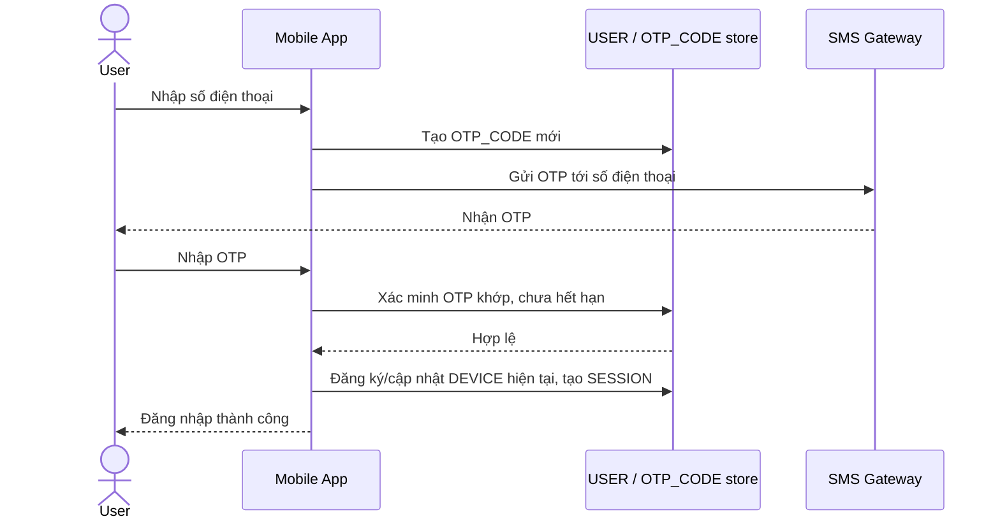

# Base sequence — OTP Login

Đây là **base**, flow "Đăng nhập bằng OTP" — nền tảng cho enhance: chính vì hệ thống coi việc nhận đúng OTP qua SMS là bằng chứng danh tính, nên kẻ tấn công chiếm được số điện thoại (SIM-swap) cũng vượt qua được bước này y hệt chủ tài khoản thật.

