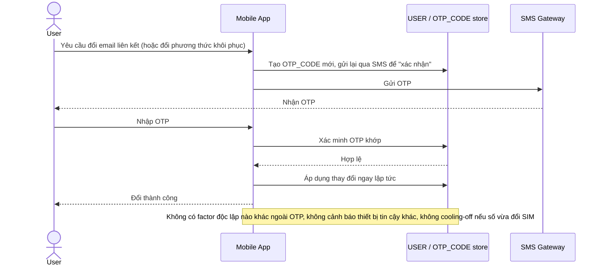

# Base sequence — Change sensitive info (chỉ dựa vào OTP)

Đây là **base**, flow "Đổi email liên kết / phương thức khôi phục" ở trạng thái hiện tại — chỉ cần verify lại OTP là đủ. Đây chính là lỗ hổng mà toàn bộ 5 yêu cầu của đề bài nhắm vào: kẻ tấn công SIM-swap có OTP hợp lệ sẽ thực hiện được y hệt chủ tài khoản thật.

