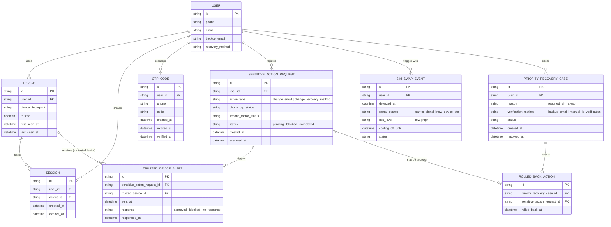

# Enhance ERD — sau khi có phòng vệ SIM-swap

Đây là ERD **sau khi** enhance được áp dụng lên base. So với base, có 4 nhóm entity mới, ứng trực tiếp với 5 yêu cầu trong đề bài:

- `SENSITIVE_ACTION_REQUEST` (mới) — mọi yêu cầu đổi email/phương thức khôi phục đều phải đi qua request có theo dõi second factor riêng, thay vì chỉ verify OTP như base.
- `TRUSTED_DEVICE_ALERT` (mới) — cảnh báo tới thiết bị tin cậy trước khi thực thi thay đổi đến từ số điện thoại vừa nhận OTP mới.
- `SIM_SWAP_EVENT` (mới) — ghi nhận tín hiệu đổi SIM (từ nhà mạng hoặc suy luận từ thiết bị lạ), tính risk_level, áp cooling-off.
- `PRIORITY_RECOVERY_CASE` + `ROLLED_BACK_ACTION` (mới) — luồng khôi phục ưu tiên không phụ thuộc số điện thoại, khóa/hoàn tác các thay đổi kẻ tấn công đã thực hiện.

