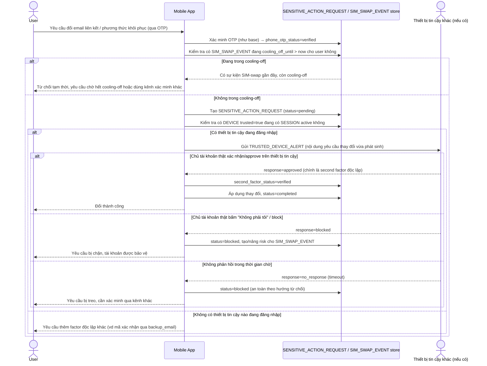

# Enhance sequence — Change sensitive info (second factor + cảnh báo thiết bị tin cậy)

Đây là **enhance**, cùng flow "Change sensitive info" đã có ở base nhưng nay thay đổi theo yêu cầu 1 và 3 của đề bài: OTP không còn là factor duy nhất/đủ mạnh — cần thêm 1 factor độc lập (xác nhận từ thiết bị tin cậy), và nếu còn thiết bị tin cậy đang đăng nhập thì phải cảnh báo tới đó trước khi thực thi, cho chủ tài khoản thật cơ hội chặn kịp thời.

