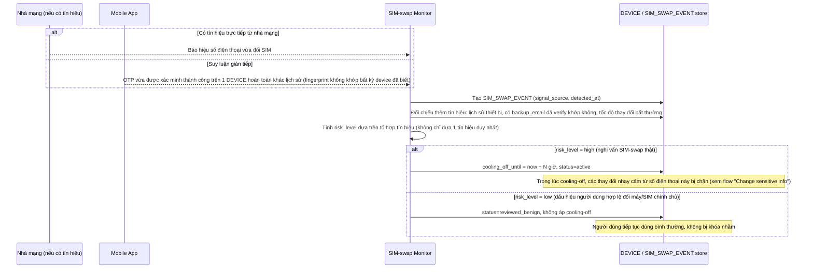

# Enhance sequence — SIM-swap detection & cooling-off

Đây là **enhance**, flow hoàn toàn mới, phát sinh từ enhance — chưa tồn tại ở base. Đáp ứng yêu cầu 2 và 4 của đề bài: phát hiện tín hiệu đổi SIM (từ nhà mạng hoặc thiết bị lạ hoàn toàn so với lịch sử), áp cooling-off, nhưng không chặn cứng mà kết hợp thêm tín hiệu khác (lịch sử thiết bị, backup email) để phân biệt người dùng hợp lệ với kẻ tấn công.

