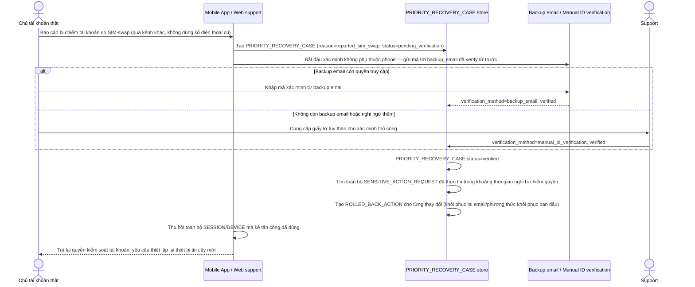

# Enhance sequence — Priority recovery after SIM-swap

Đây là **enhance**, flow hoàn toàn mới, phát sinh từ enhance — chưa tồn tại ở base. Đáp ứng yêu cầu thứ 5 của đề bài: khi chủ tài khoản thật báo cáo đã bị chiếm quyền qua SIM-swap, cần 1 luồng khôi phục ưu tiên **không phụ thuộc vào số điện thoại đó nữa**, đồng thời khóa/hoàn tác ngay các thay đổi kẻ tấn công đã thực hiện.

