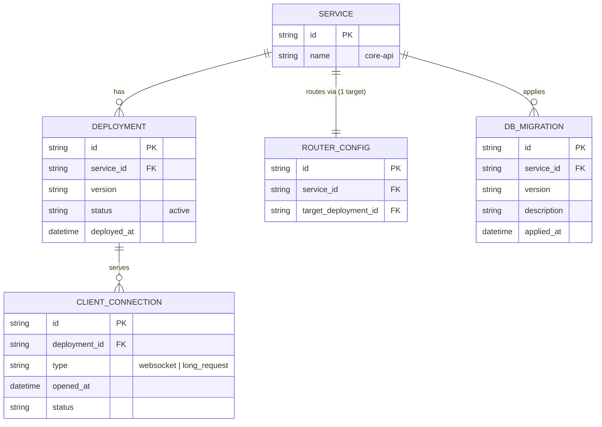

# Base ERD — core-api trước khi có blue-green deployment

Đây là **base**: mô hình dữ liệu suy luận từ ngữ cảnh đề bài, thể hiện trạng thái hệ thống **trước khi** có blue-green deployment. Đề bài nói service "core-api" được deploy nhiều lần/tuần, có migration schema DB đi kèm, và có session/kết nối dài (WebSocket) đang mở — nên base cần đủ: service, deployment (chỉ 1 target đang chạy tại 1 thời điểm), router trỏ thẳng tới target đó, migration DB, và các connection đang mở trên deployment. Chưa có entity nào phục vụ smoke test/switch có thể đảo ngược/rollback policy tự động/connection draining — những thứ đó là phần enhance.

