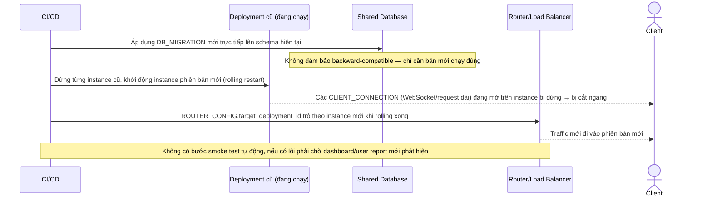

# Base sequence — Deploy (rolling, chưa có blue-green)

Đây là **base**, flow "Deploy phiên bản mới" ở trạng thái hiện tại — rolling deploy trực tiếp, không có bản song song để test trước. Flow này liên quan mật thiết tới enhance vì toàn bộ yêu cầu 1-3 của đề bài đều nhằm cải tổ lại đúng flow này.

