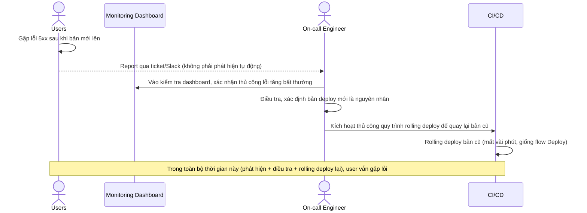

# Base sequence — Rollback (thủ công, chưa có tiêu chí tự động)

Đây là **base**, flow "Xử lý khi bản deploy mới có lỗi" ở trạng thái hiện tại — hoàn toàn thủ công, phát hiện chậm. Flow này liên quan mật thiết tới enhance vì yêu cầu thứ 4 của đề bài chính là tự động hoá lại đúng flow này.

