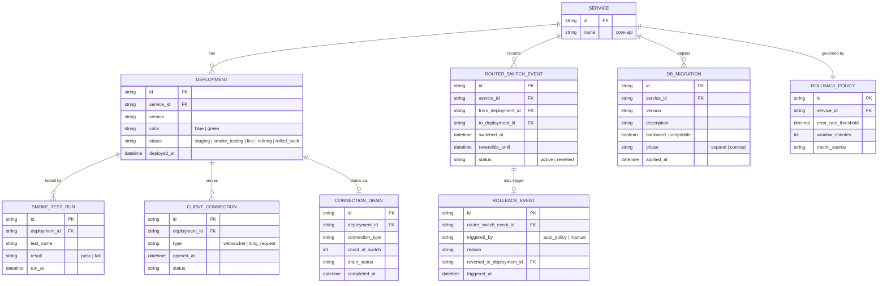

# Enhance ERD — sau khi có blue-green deployment

Đây là ERD **sau khi** enhance được áp dụng lên base. So với base, có 4 thay đổi chính, ứng trực tiếp với 5 yêu cầu trong đề bài:

- `DEPLOYMENT` thêm `color` (blue/green) và `status` mở rộng (staging/smoke_testing/live/retiring/rolled_back) — thay vì chỉ có đúng 1 deployment "active".
- `SMOKE_TEST_RUN` (mới) — bắt buộc pass trước khi router chuyển traffic thật.
- `ROUTER_SWITCH_EVENT` (mới) — thao tác chuyển traffic gần như tức thời và có thể đảo ngược (`reversible_until`), thay cho việc router chỉ đơn giản trỏ theo instance đang chạy như base.
- `DB_MIGRATION` thêm `backward_compatible` + `phase` (expand/contract) — đảm bảo blue vẫn chạy đúng trong giai đoạn chuyển tiếp.
- `ROLLBACK_POLICY` + `ROLLBACK_EVENT` (mới) — tiêu chí rollback tự động, không chờ phát hiện thủ công.
- `CONNECTION_DRAIN` (mới) — xử lý có kiểm soát các connection đang mở trên blue khi traffic đã chuyển sang green.

