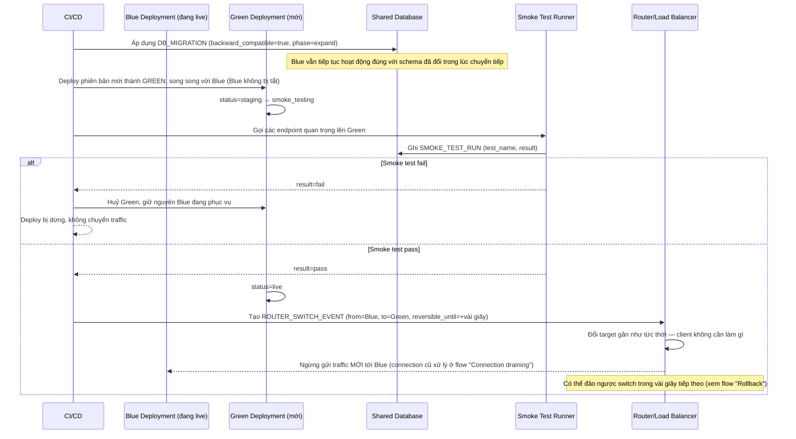

# Enhance sequence — Deploy (blue-green, smoke test, migration backward-compatible)

Đây là **enhance**, cùng flow "Deploy" đã có ở base nhưng nay thay đổi hoàn toàn theo yêu cầu 1-3 của đề bài: green được deploy song song (không tắt blue), migration phải backward-compatible để blue vẫn chạy đúng, smoke test bắt buộc pass trước khi router chuyển traffic thật, và việc chuyển traffic là thao tác tức thời ở router.

