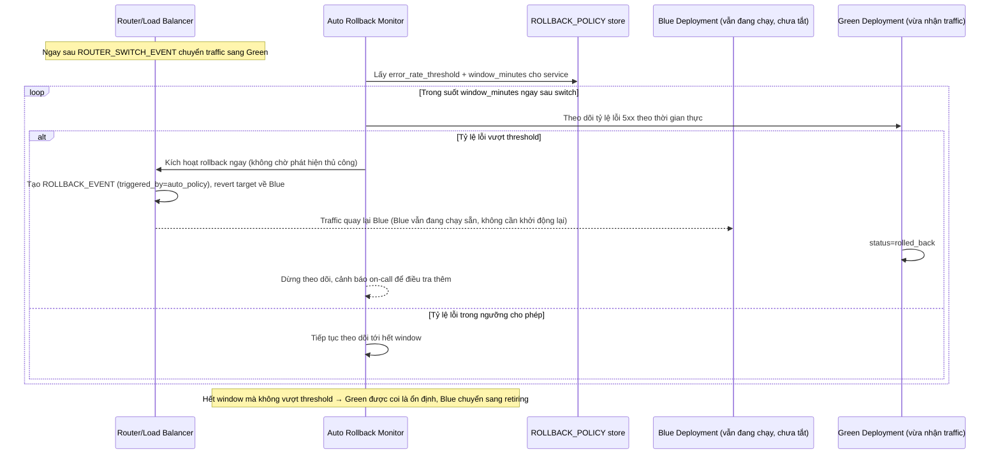

# Enhance sequence — Rollback (tự động, theo tiêu chí lỗi 5xx)

Đây là **enhance**, cùng flow "Rollback" đã có ở base nhưng nay thay đổi hoàn toàn theo yêu cầu thứ 4 của đề bài: có `ROLLBACK_POLICY` định nghĩa rõ tiêu chí (tỷ lệ lỗi 5xx vượt ngưỡng X% trong Y phút), và giám sát chạy tự động ngay sau khi router chuyển traffic — không chờ user report như base.

