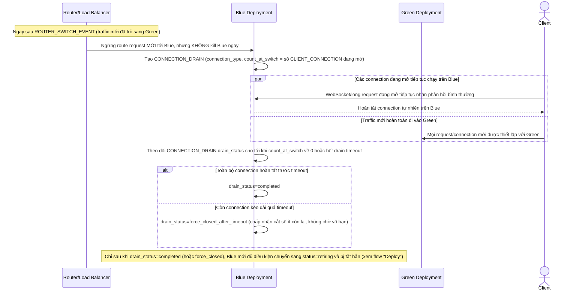

# Enhance sequence — Connection draining khi chuyển traffic

Đây là **enhance**, flow hoàn toàn mới, phát sinh từ enhance — chưa tồn tại ở base (ở base, connection bị cắt ngang thẳng khi instance cũ bị dừng). Đáp ứng yêu cầu thứ 5 của đề bài: session/kết nối đang mở (WebSocket, request dài) tại thời điểm chuyển đổi không bị cắt ngang, mà hoàn tất trên Blue hoặc được chuyển tiếp có kiểm soát.

