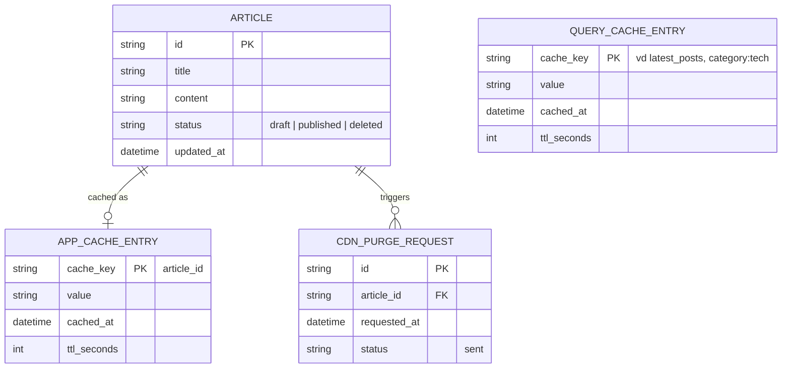

# Base ERD — CMS đa tầng cache trước khi có orchestration invalidation

Đây là **base**: mô hình dữ liệu suy luận từ ngữ cảnh đề bài, thể hiện trạng thái hệ thống **trước khi** có cơ chế điều phối invalidation xuyên 3 tầng. Đề bài mô tả hệ thống đã có sẵn 3 tầng cache (CDN edge, application cache, query cache) — nên base cần đủ: bài viết, cache tầng ứng dụng theo article_id, cache tầng query (theo danh sách như "latest_posts"), và 1 request purge CDN thô sơ (fire-and-forget, không xác nhận PoP). Chưa có entity nào phục vụ điều phối thứ tự/retry/đo staleness — những thứ đó là phần enhance.

